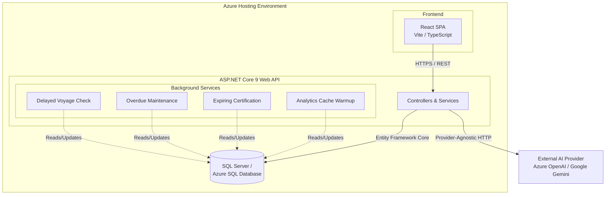

# System Architecture

## Architecture Notes
- **Frontend**: A React Single Page Application utilizing TanStack Query for robust server-state synchronization and caching, with Zustand handling localized client state.
- **Backend**: An ASP.NET Core 9 Web API utilizing the Repository and Unit of Work patterns to abstract Entity Framework Core interactions.
- **AI Integration**: The AI provider integration is heavily abstracted using the Decorator pattern. If API keys are missing, it gracefully degrades via a `NullAiProvider` rather than faulting the application.
- **Background Services**: Built-in `IHostedService` implementations run alongside the API to process time-sensitive domain logic (e.g., flagging delayed voyages) without requiring external cron jobs.
